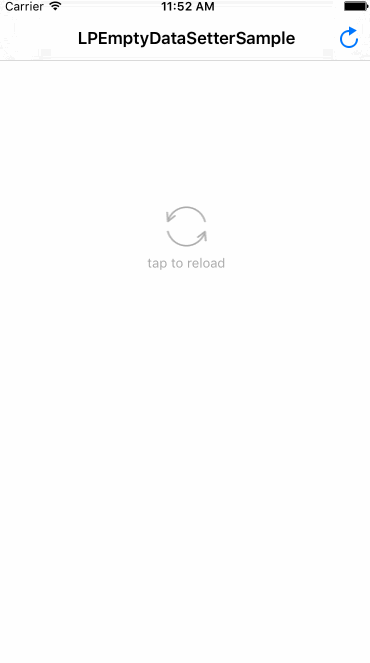

# LPEmptyDataSetter

create placeholder view for empty data UIViewController/UITableViewController/UICollectionViewController,  etc. which needs one line code only!

# Features

LPEmptyDataSetter is quite different from other empty dataset third-party lib cause it's base on KVO & runtime, so when use it just set the key for observe. It's very convenient & simple.

# Installation

- use cocoapods
```swift
pod 'LPEmptyDataSetter', '~> 0.0.3'
```
- manual import
```swift
just download lib folder and add into your project
```

# Usage

- 1.Firstly custom your placeholder view (any view or subClass of UIView)
```swift
// for example, custom placeholder view via UIButton
UIButton *placeholder = [[UIButton alloc] init];
placeholder.frame = CGRectMake(150, 200, 80, 80);
```

- 2.Add LPEmptyDataSetter to your viewController & view
```swift
/**
* target:view controller which placeholder will show inside
* key: observe key name that KVO supports
* view: placeholder view
* frame: placeholder's frame
*/
[LPEmptyDataSetter emptyDataSetWithTarget:self key:@"data" view:placeholder frame:placeholder.frame];
```
- 3.Additional
```swift
placeholder view is under your view controller's control, you can add some event for it so that you can change the placeholder view dynamically, such as sample project show. enjoy it now!
```

# Screenshot



# Release notes

#### ver. 0.0.3
`fix bug of emptyDataSet view back when current view s height narrow`

#### ver. 0.0.2
`fix a bug causing crash`

#### ver. 0.0.1
`first commit`
